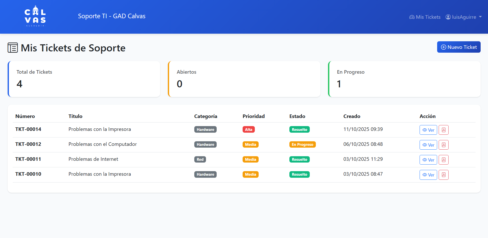
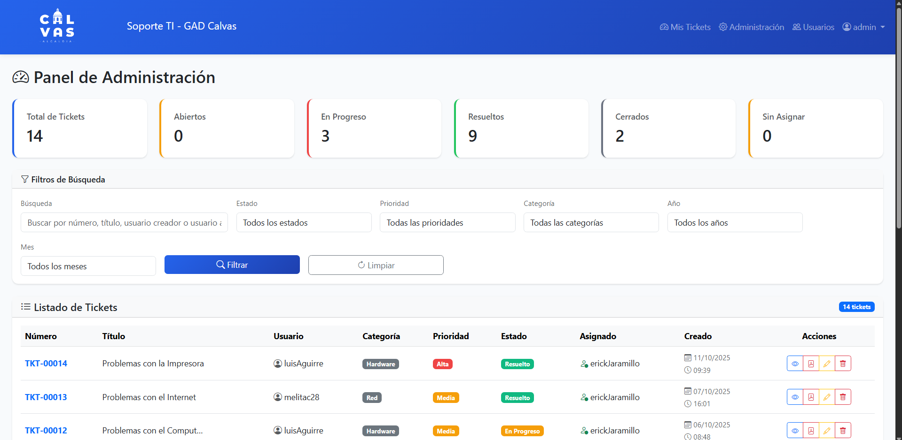
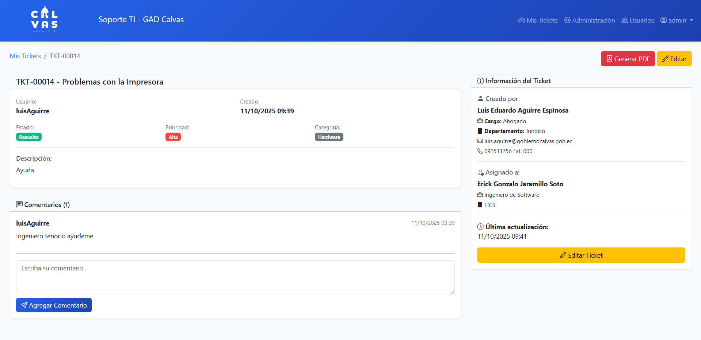
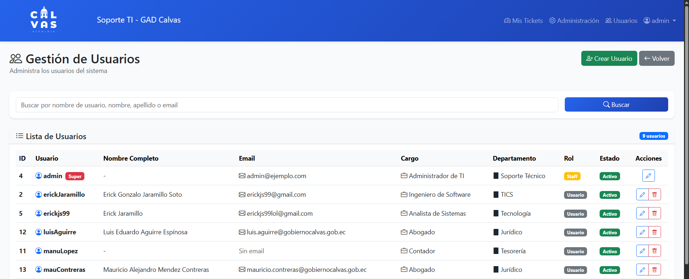

🎫 Sistema de Tickets de Soporte TI

Sistema completo de gestión de tickets de soporte técnico desarrollado con Django
Demo • Características • Instalación • Tecnologías

📋 Descripción
Sistema web profesional para la gestión de tickets de soporte técnico de TI, diseñado para optimizar la comunicación entre usuarios y el equipo de soporte. Incluye gestión completa de usuarios, generación de reportes PDF, sistema de comentarios en tiempo real y panel de administración avanzado.
✨ Características Principales
👥 Para Usuarios

✅ Dashboard personalizado con estadísticas en tiempo real
✅ Creación de tickets con clasificación por categoría y prioridad
✅ Seguimiento de tickets con sistema de comentarios
✅ Generación de reportes PDF profesionales
✅ Notificaciones de cambios de estado
✅ Historial completo de tickets creados

🛠️ Para Administradores

✅ Panel de administración avanzado con filtros múltiples
✅ Gestión de usuarios (crear, editar, eliminar)
✅ Sistema de asignación de tickets a técnicos
✅ Filtros por mes/año para análisis estadístico
✅ Búsqueda inteligente por múltiples criterios
✅ Estadísticas en tiempo real (tickets abiertos, resueltos, etc.)
✅ Exportación a PDF de tickets individuales

🎨 Diseño y UX

✅ Interfaz moderna con Bootstrap 5
✅ Diseño responsive para móviles, tablets y desktop
✅ Animaciones suaves y transiciones CSS
✅ Sistema de badges de colores por estado/prioridad
✅ Dark mode ready (preparado para modo oscuro)

🔐 Seguridad

✅ Autenticación robusta con Django Auth
✅ Permisos por roles (Usuario/Staff/Admin)
✅ Protección CSRF en todos los formularios
✅ Validación de datos en backend y frontend
✅ Sesiones seguras con timeout automático

🚀 Tecnologías Utilizadas
TecnologíaUsoPython 3.8+Lenguaje de programación principalDjango 4.2Framework web backendSQLiteBase de datos (desarrollo)Bootstrap 5Framework CSS responsiveReportLabGeneración de PDFsBootstrap IconsLibrería de iconosJavaScript (Vanilla)Interactividad frontend
📸 Capturas de Pantalla
Login

Dashboard de Usuario

Panel de Administración

Detalle de Ticket

Gestión de Usuarios

🛠️ Instalación
Prerrequisitos

Python 3.8 o superior
pip (gestor de paquetes de Python)
Virtualenv (recomendado)
Git

Paso 1: Clonar el Repositorio
bashgit clone https://github.com/tu-usuario/sistema-tickets-ti.git
cd sistema-tickets-ti
Paso 2: Crear y Activar Entorno Virtual
Windows:
bashpython -m venv venv
venv\Scripts\activate
Linux/Mac:
bashpython3 -m venv venv
source venv/bin/activate
Paso 3: Instalar Dependencias
bashpip install -r requirements.txt
Paso 4: Configurar Base de Datos
bashpython manage.py makemigrations
python manage.py migrate
Paso 5: Crear Superusuario
bashpython manage.py createsuperuser
Ingresa los datos solicitados:

Username: admin
Email: admin@ejemplo.com
Password: (tu contraseña segura)

Paso 6: (Opcional) Cargar Datos de Prueba
bashpython manage.py create_demo_data
Esto creará:

3 usuarios regulares (usuario1, usuario2, usuario3)
2 usuarios staff (soporte1, soporte2)
10 tickets de ejemplo
Contraseña para todos: password123

Paso 7: Ejecutar el Servidor
bashpython manage.py runserver
Paso 8: Acceder al Sistema
Abre tu navegador y visita:

Aplicación principal: http://127.0.0.1:8000/
Panel de Admin Django: http://127.0.0.1:8000/admin/

📁 Estructura del Proyecto

sistema-tickets-ti/
├── soporte_ti/                 # Configuración principal
│   ├── settings.py            # Configuración de Django
│   ├── urls.py                # URLs principales
│   └── wsgi.py                # Configuración WSGI
├── tickets/                    # Aplicación principal
│   ├── models.py              # Modelos (Ticket, UserProfile, Comment)
│   ├── views.py               # Vistas y lógica de negocio
│   ├── forms.py               # Formularios de Django
│   ├── urls.py                # URLs de la aplicación
│   ├── admin.py               # Configuración del admin
│   ├── pdf_generator.py       # Generador de PDFs
│   ├── templates/             # Templates HTML
│   │   └── tickets/
│   │       ├── base.html
│   │       ├── login.html
│   │       ├── user_dashboard.html
│   │       ├── admin_dashboard.html
│   │       ├── ticket_detail.html
│   │       ├── create_ticket.html
│   │       ├── update_ticket.html
│   │       ├── user_list.html
│   │       ├── user_form.html
│   │       └── user_delete.html
│   └── management/
│       └── commands/
│           ├── create_demo_data.py
│           └── generate_report.py
├── static/                     # Archivos estáticos
├── media/                      # Archivos subidos
├── requirements.txt            # Dependencias Python
└── manage.py                   # Script de gestión Django

🎯 Casos de Uso
1. Usuario Regular
1. Login → Dashboard
2. Crear nuevo ticket
3. Ver tickets propios
4. Agregar comentarios
5. Descargar PDF del ticket
6. Logout
2. Técnico de Soporte (Staff)
1. Login → Panel Admin
2. Ver todos los tickets
3. Filtrar por estado/prioridad/mes
4. Asignar tickets a técnicos
5. Actualizar estado de tickets
6. Agregar comentarios de seguimiento
7. Generar reportes PDF
8. Gestionar usuarios
3. Administrador
1. Login → Panel Admin
2. Gestión completa de usuarios
3. Asignación de permisos
4. Visualización de estadísticas
5. Exportación de reportes
6. Configuración del sistema
📊 Comandos Útiles
Crear Datos de Demostración
bashpython manage.py create_demo_data
Generar Reporte de Tickets
bashpython manage.py generate_report --days 30
Limpiar Base de Datos (CUIDADO)
bashpython manage.py flush
Crear Backup de Base de Datos
bashpython manage.py dumpdata > backup.json
Restaurar desde Backup
bashpython manage.py loaddata backup.json
🔧 Configuración Avanzada
Configurar Email (Notificaciones)
Edita settings.py:
pythonEMAIL_BACKEND = 'django.core.mail.backends.smtp.EmailBackend'
EMAIL_HOST = 'smtp.gmail.com'
EMAIL_PORT = 587
EMAIL_USE_TLS = True
EMAIL_HOST_USER = 'tu-email@gmail.com'
EMAIL_HOST_PASSWORD = 'tu-contraseña-de-aplicacion'
DEFAULT_FROM_EMAIL = 'Sistema de Tickets <tu-email@gmail.com>'
Cambiar a PostgreSQL

Instalar psycopg2:

bashpip install psycopg2-binary

Editar settings.py:

pythonDATABASES = {
    'default': {
        'ENGINE': 'django.db.backends.postgresql',
        'NAME': 'tickets_db',
        'USER': 'tu_usuario',
        'PASSWORD': 'tu_contraseña',
        'HOST': 'localhost',
        'PORT': '5432',
    }
}
🐛 Solución de Problemas
Error: "No module named 'tickets'"
bash# Asegúrate de estar en el directorio correcto
cd sistema-tickets-ti
python manage.py runserver
Error: "TemplateDoesNotExist"
bash# Verifica la estructura de carpetas
mkdir -p tickets/templates/tickets
Error: "CSRF verification failed"
bash# Limpia las sesiones
python manage.py clearsessions
📈 Roadmap

 API REST con Django REST Framework
 Notificaciones en tiempo real con WebSockets
 Sistema de adjuntos de archivos
 Dashboard con gráficos (Chart.js)
 Exportación a Excel
 Sistema de SLA (Service Level Agreement)
 Chat en vivo
 Modo oscuro (Dark Mode)
 Aplicación móvil (React Native)
 Integración con Slack/Teams

🤝 Contribuir
Las contribuciones son bienvenidas! Por favor:

Fork el proyecto
Crea una rama para tu feature (git checkout -b feature/AmazingFeature)
Commit tus cambios (git commit -m 'Add some AmazingFeature')
Push a la rama (git push origin feature/AmazingFeature)
Abre un Pull Request

📝 Licencia
Este proyecto está bajo la Licencia MIT. Ver el archivo LICENSE para más detalles.
👨‍💻 Autor
Erick Jaramillo

GitHub: @erickgjs99
LinkedIn: https://www.linkedin.com/in/erick-gonzalo-jaramillo-soto-191a20167/
Email: erickwork99@gmail.com

🙏 Agradecimientos

Django Documentation
Bootstrap
Bootstrap Icons
ReportLab

⭐ Si este proyecto te fue útil, considera darle una estrella ⭐
Hecho con ❤️ y Django

